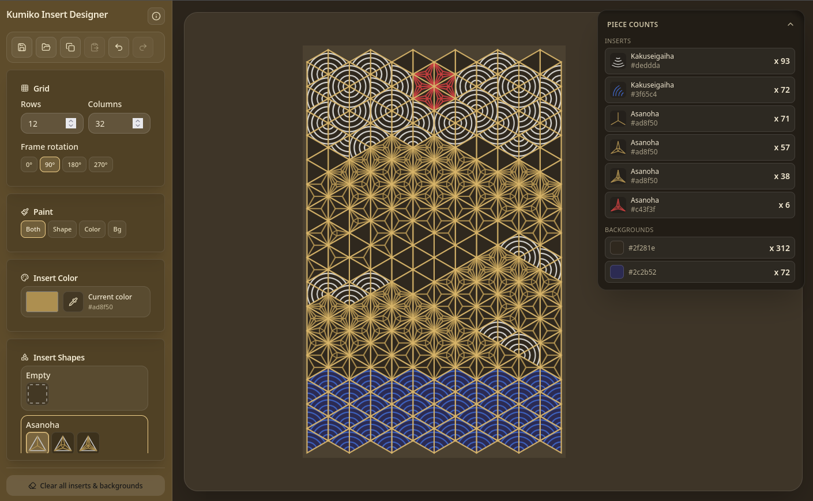

# Kumiko Insert Designer

**[Open the app (GitHub Pages)](https://nicole-w.github.io/kumiko-designer/)** — runs in the browser, no install.

A small web app for laying out **mitsukude-style triangular grids** with decorative **kumiko inserts**, colors, and per-triangle backgrounds. Built as a helper for planning real panels (for example, parts you will 3D print in specific filament colors).

## Features

- **Triangular lattice** with adjustable rows/columns and frame rotation (0° / 90° / 180° / 270°).
- **Multiple insert patterns** (asanoha, shippo, custom motifs, etc.) with density levels where supported.
- **Paint modes**: shape only, color only, both, or **background fill** only.
- **Rotation-dependent inserts**: hover highlights the nearest corner; placement stores orientation for those patterns.
- **Piece counts overlay** (top-right): running totals by insert variant and by background color, with small previews.
- **Save / load** layout JSON (includes placements, backgrounds, and UI state).

## Screenshot



## Requirements

- [Node.js](https://nodejs.org/) 18+ recommended (uses native `fetch` / modern JS).

## Quick start

```bash
npm install
npm start
```

`npm start` builds first (`prestart`), then serves **`public/`** at **http://localhost:3000** (or the port shown).

### Other scripts

| Command        | Description                                      |
| -------------- | ------------------------------------------------ |
| `npm run build` | Build `styles.css` and `app.js` into **`public/`** |
| `npm run build:css` | CSS only                                       |
| `npm run build:js`  | JS bundle only                                 |

### GitHub Pages

**Settings → Pages → Source: GitHub Actions.** On push to `main` or `master`, `.github/workflows/static.yml` runs `npm ci`, **`npm run build`** (writes `public/app.js` and `public/styles.css`), then deploys **`public/`**.

### Port

Override the server port with the `PORT` environment variable, for example:

```bash
PORT=8080 npm start
```

## Project layout

| Path | Role |
| ---- | ---- |
| `src/App.jsx` | Main React UI and canvas logic |
| `src/main.jsx` | App entry (mounts into `#root`) |
| `src/inserts/` | Insert implementations and `registry.js` |
| `src/layoutPersistence.js` | Save/load JSON format |
| `public/` | Static site (`index.html`, built `app.js` / `styles.css`) — served locally and deployed to Pages |
| `docs/` | README assets (e.g. `screenshots/`) |
| `server.js` | Minimal static HTTP server |

## Layout file format

Saved files are JSON with `format: "kumiko-layout"`, grid settings, `placements`, optional `cellBackgrounds`, and `ui` (selected tool, color, density, paint scope). Unknown insert types in older files may be skipped on load with console warnings.

## License

[MIT](LICENSE) — see `LICENSE` in the repository root.
